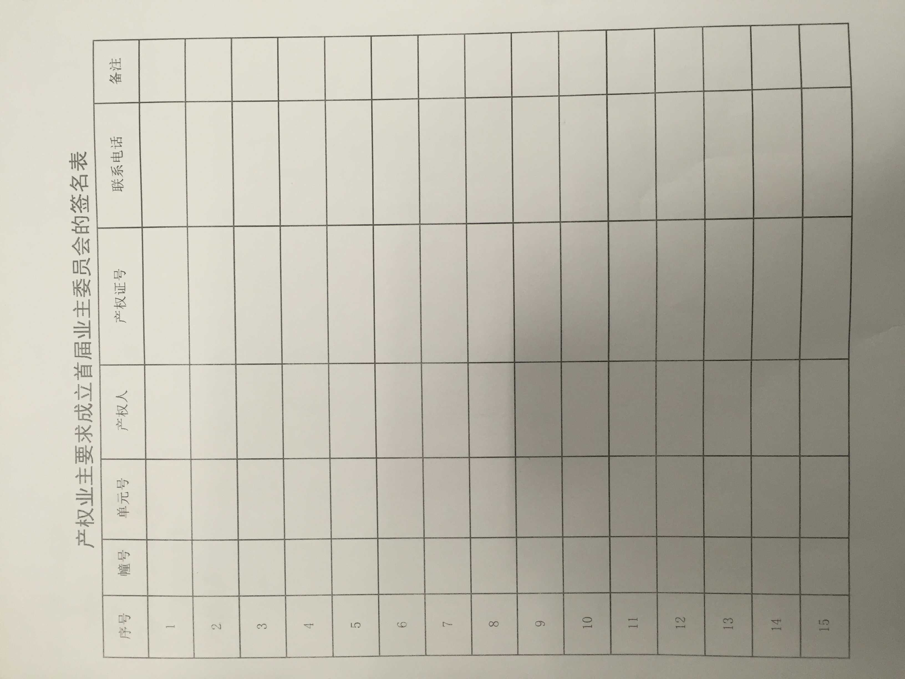

# 高新区管委会提供业委会成立指南

* [福建省物业管理条例](https://github.com/mdxjw/docs/blob/master/guide/%E7%A6%8F%E5%BB%BA%E7%9C%81%E7%89%A9%E4%B8%9A%E7%AE%A1%E7%90%86%E6%9D%A1%E4%BE%8B.wps)
* [福州市物业管理若干规定(修订)](https://github.com/mdxjw/docs/blob/master/guide/%E7%A6%8F%E5%B7%9E%E5%B8%82%E7%89%A9%E4%B8%9A%E7%AE%A1%E7%90%86%E8%8B%A5%E5%B9%B2%E8%A7%84%E5%AE%9A%20%28%E4%BF%AE%E8%AE%A2%EF%BC%89.wps)
* [福州业委会选举22个文件表格](https://github.com/mdxjw/docs/blob/master/guide/%E7%A6%8F%E5%B7%9E%E4%B8%9A%E5%A7%94%E4%BC%9A%E9%80%89%E4%B8%BE22%E4%B8%AA%E6%96%87%E4%BB%B6%E8%A1%A8%E6%A0%BC.doc)
* [业主大会和业委会指导规则](https://github.com/mdxjw/docs/blob/master/guide/%E4%B8%9A%E4%B8%BB%E5%A4%A7%E4%BC%9A%E5%92%8C%E4%B8%9A%E4%B8%BB%E5%A7%94%E5%91%98%E4%BC%9A%E6%8C%87%E5%AF%BC%E8%A7%84%E5%88%99.doc)
* [产权业主要求成立首届业委会的签名表](https://github.com/mdxjw/docs/blob/master/guide/%E4%BA%A7%E6%9D%83%E4%B8%9A%E4%B8%BB%E8%A6%81%E6%B1%82%E6%88%90%E7%AB%8B%E9%A6%96%E5%B1%8A%E4%B8%9A%E4%B8%BB%E5%A7%94%E5%91%98%E4%BC%9A%E7%9A%84%E7%AD%BE%E5%90%8D%E8%A1%A8.xls)

## 福州市提供业委会相关示范文本

示范文本的详细内容参考 [福州业委会选举22个文件表格](https://github.com/mdxjw/docs/blob/master/guide/%E7%A6%8F%E5%B7%9E%E4%B8%9A%E5%A7%94%E4%BC%9A%E9%80%89%E4%B8%BE22%E4%B8%AA%E6%96%87%E4%BB%B6%E8%A1%A8%E6%A0%BC.doc) , 这里仅列出范本清单：

1. 关于成立业主大会筹备组的公告
2. 筹备组成员推荐表
3. 业主大会筹备组成员名单公示
4. 业主委员会委员候选人条件和产生办法公告
5. 业主委员会委员候选人推荐表
6. 业主委员会委员候选人确认表
7. 业主委员会委员候选人名单公示
8. 关于召开首次业主大会的公告
9. 业主委员会委员选票
10. 业主大会表决票
11. 业主大会选举、表决投票委托书
12. 首次业主大会决定事项公告
13. 业主委员会委员名单公告
14. 解聘（续聘）物业管理企业表决票
15. 选聘物业服务企业表决票
16. 首次业主大会会议业主委员会选举统计结果
17. 业主大会表决票统计结果
18. 业主委员会换届选举通知
19. 业主委员会备案表
20. 业主委员会备案证明
21. 业主委员会刻制印章申请
22. 业主委员会印章备案报告

## 注意点

* 为防止业主签名表被人伪造签名，需业主提供**产权证号**
* **产权证号**可以是房产证号，也可以是房屋预售证号
* 筹备组成员可以是产权业主，也可以是非产权业主
* 业委会成员必须是产权业主
* 成立业主大会筹备组必须超过 **50%** 业主签名
* 筹备组应积极主动联系业主，对于未入住业主可要求物业当面联系业主咨询是否愿意提供联系方式给筹备组

## 其他

* 签名表使用提供的表格打印出来，效果如下：

